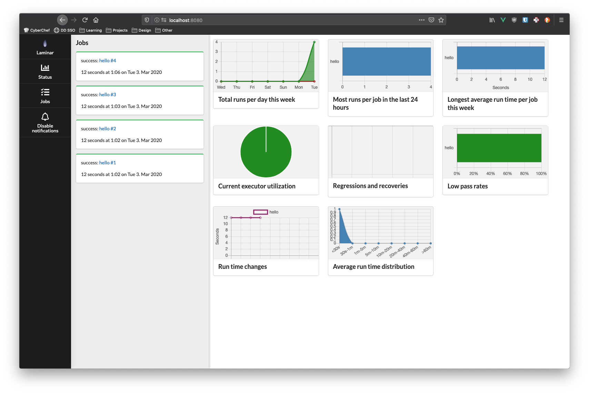
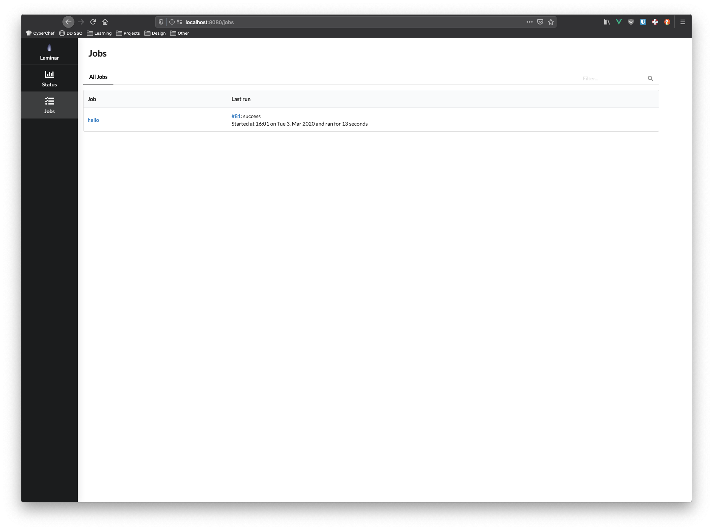
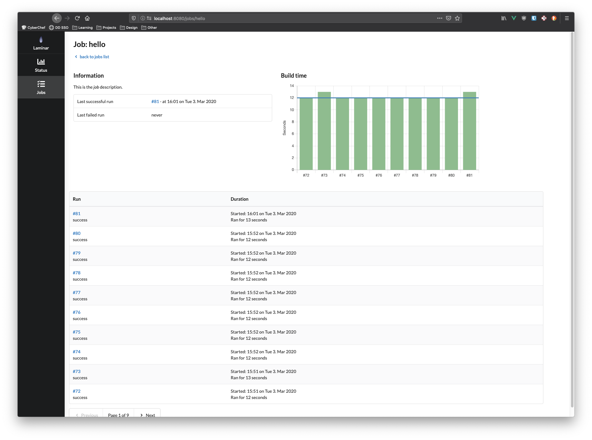
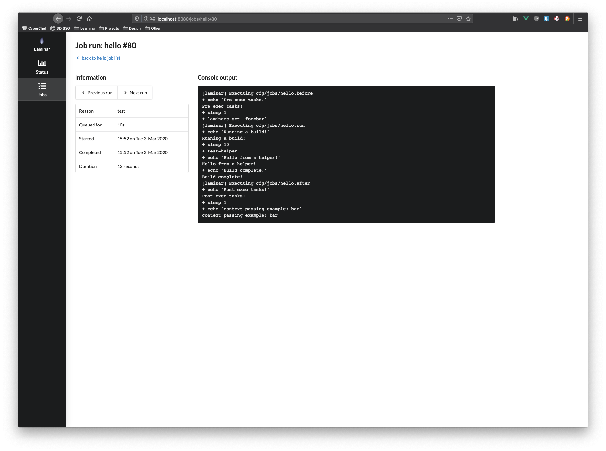

# semantic-laminar-theme

UI theme for [Laminar](https://laminar.ohwg.net) that utilizes Semantic UI.

## Install

Copy index.html and style.css into /var/lib/laminar/custom and restart your
Laminar instance.

Note: this will not work until https://github.com/ohwgiles/laminar/pull/113
is merged and released.

## Screenshots

